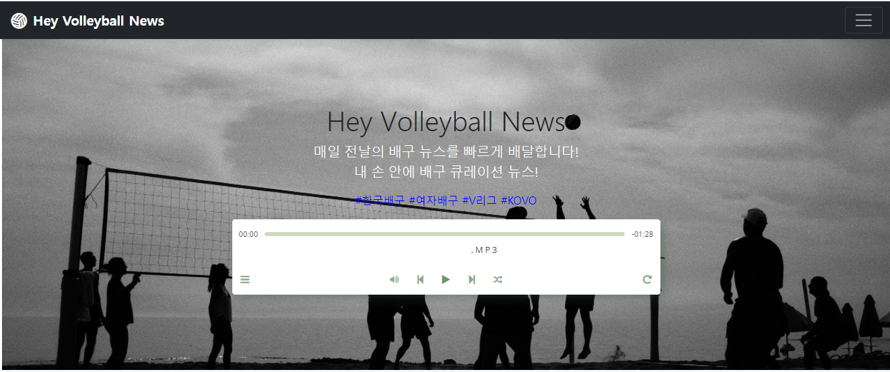
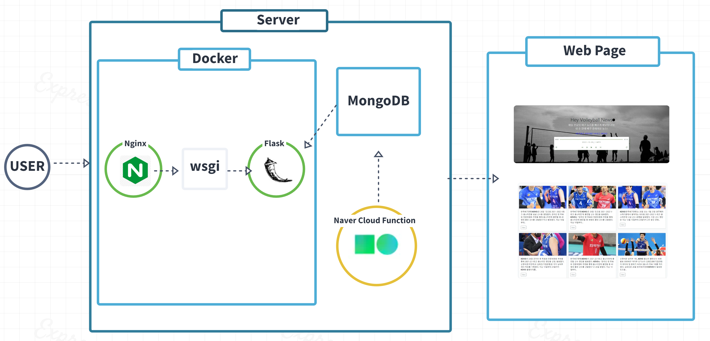
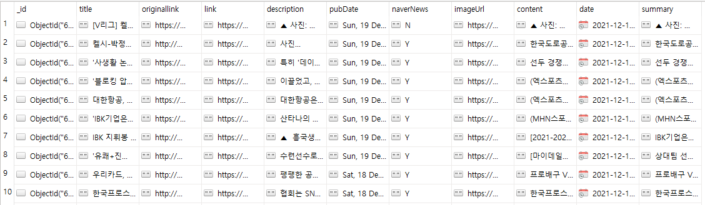
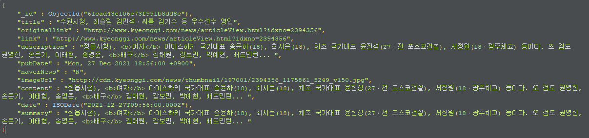
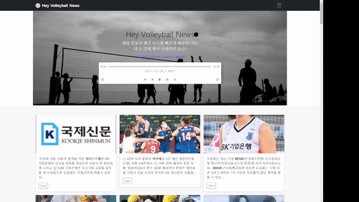
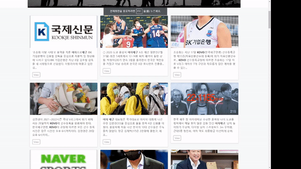
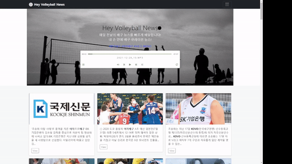

# Heyvolleyballnews




## 1. Heyvolleyballnews 이란

스포츠 뉴스들의 기사 수집 후, 수집된 뉴스를 요약 및 음성합성, 오디오 기능을 통해 스포츠 소식을 알려주는 web service

> **Project Duration** : 2021.9.1 ~ 2021.10.22

> **Server Renewal Duration** : 2021.11.10 ~ 2021.12.24

## 2. 구성



## 3. 서버

- Naver Cloud Flatform 에서 서버를 대여하여 사용
  - [Naver Cloud Server](https://www.ncloud.com/product/compute/server)
- Micro server / ubuntu-18.04 / 2vCPU, 4GB Mem, 50GB Disk
  - [Naver Cloud](https://www.ncloud.com/product/compute/server)
- MongoDB 를 사용하여 데이터 관리
  - [MongoDB](https://www.mongodb.com/)
- Flask, Nginx, WSGI(uWSGI), Docker를 사용한 웹 서버
  - [Flask](https://flask.palletsprojects.com/en/2.0.x/)
  - [Nginx](https://www.nginx.com/)
  - [uWSGI](https://uwsgi-docs.readthedocs.io/en/latest/)
  - [Docker](https://www.docker.com/)


## 4. 데이터 수집 / 가공

- Naver 에서 제공하는 API 를 사용하여 데이터를 수집하고 가공한다.
  - [Naver Cloud AI Service](https://www.ncloud.com/product/aiService)
- Web Scrapping 하여 데이터를 수집한다.
- NaverCloudFunction 을 사용하여 서버의 DB 에 원격 접속하여 수집한 데이터를 저장한다.
  - [Naver Cloud Function ](https://www.ncloud.com/product/compute/cloudFunctions)





### 1. 뉴스 수집

- Naver News API 사용
  - [Naver News API](https://developers.naver.com/docs/serviceapi/search/news/news.md)
- [ title, originallink, link, description, pubDate ] 수집

```python
 news_items = []

    for keyword in keywords:
        url = 'https://openapi.naver.com/v1/search/news.json'

        sort = 'date'
        start_num = 1

        params = {'display': display_num, 'start': start_num,
                  'query': keyword.encode('utf-8'), 'sort': sort}
        headers = {'X-Naver-Client-Id': client_id,
                   'X-Naver-Client-Secret': client_secret, }

        r = requests.get(url, headers=headers,  params=params)

        if r.status_code == requests.codes.ok:
            result_response = json.loads(r.content.decode('utf-8'))

            result = result_response['items']
            for item in result:
                originallink = item['originallink']
                link = item['link']

                if originallink == link:
                    item['naverNews'] = 'N'
                else:
                    item['naverNews'] = 'Y'

                item['imageUrl'] = scrape_image_url(link)

                if item['naverNews'] == 'Y':
                    content = scrape_content(link)
                    item['content'] = content if content != '' else item['description']
                else:
                    item['content'] = item['description']
```


### 2. 뉴스 본문 내용 수집

- 수집한 URL 을 통해 뉴스의 본문을 수집한다.
- Summary 를 하기 위한 본문 수집

```python
    content = ''
    headers = {
        'User-Agent': 'Mozilla/5.0 (Windows NT 10.0; Win64; x64)AppleWebKit/537.36 (KHTML, like Gecko) Chrome/73.0.3683.86 Safari/537.36'}

    try:
        data = requests.get(url, headers=headers)
    except SSLError as e:
        data = requests.get(url, headers=headers, verify=False)

    soup = BeautifulSoup(data.text, 'html.parser')
    content = ''

    if 'news.naver.com' in url:
        naver_content = soup.select_one(
            '#articeBody') or soup.select_one('#articleBodyContents')

        if not naver_content:
            return content

        for tag in naver_content(['div', 'span', 'p', 'br', 'script']):
            tag.decompose()
        content = naver_content.text.strip()
```

### 3. Summary

- Clova Summary API 를 사용하여 뉴스 본문을 요약 한다.
  - [Clova Summary API](https://www.ncloud.com/product/aiService/clovaSummary)
- Sentiment 분석 API 인 Clova Sentiment API 를 사용하기 위해서는 글자 수 제한이 1000자 이기 때문에 본문을 1000자 이하로 요약할 필요가 있다.

```python
    collection.update_many({'date': {'$exists': False}}, [
        {'$set': {'date': {"$toDate": "$pubDate"}}}])

    target_date = cal_datetime_utc(before_date)

    summary_items = list(collection.find(
        {'summary': {'$exists': False}, 'date': {'$gte': target_date['date_st'], '$lte': target_date['date_end']}}, {'_id': False}))

    for item in summary_items:
        if 200 < len(item['content']) < 2000:
            result = summary(txt=item['content'], client_id=summary_api_info['client_id'],
                             client_secret=summary_api_info['client_secret']).replace('</b>', "").replace('<b>', "") or item['description'].replace('</b>', "").replace('<b>', "")
        else:
            result = item['description'].replace(
                '</b>', "").replace('<b>', "")
```

```python
    headers = {'X-NCP-APIGW-API-KEY-ID': client_id,
               'X-NCP-APIGW-API-KEY': client_secret,
               'Content-Type': 'application/json'}

    document = {'content': txt}
    option = {'language': 'ko', 'model': 'news', 'tone': 0, 'summaryCount': 9}

    data = {'document': document, 'option': option}

    r = requests.post('https://naveropenapi.apigw.ntruss.com/text-summary/v1/summarize',
                      headers=headers, data=json.dumps(data))

    summary_txt = ''
    if r.status_code == requests.codes.ok:
        result_response = json.loads(r.content)
        summary_txt = result_response['summary']
```

### 4. Voice
- Clova Voice api를 사용하여 summary한 내용의 데이터를 묶어서 음성 변환작업을 한다.
  - [Clova Voice API](https://www.ncloud.com/product/aiService/clovaVoice)

```python
    headers = {"Content-Type": "application/x-www-form-urlencoded",
                "X-NCP-APIGW-API-KEY-ID": client_id,
                "X-NCP-APIGW-API-KEY": client_secret, }

      r = requests.post(url, headers=headers, data=data)

      # =========C. Response=========
      # 응답결과 저장할 파일 경로 path 설정하기
      dir_parts = [file_name]
      path = Path.cwd().joinpath(*dir_parts)
      print(path)

      if(r.status_code == requests.codes.ok):
          print("------TTS mp3 저장 시작------")
          with open(path, 'wb') as f:
              f.write(r.content)
          result['msg'] = f"TTS mp3 저장 완료 : {path}"

      else:
          result['status'] = r.status_code
          result['msg'] = r.content.decode('utf-8')

```


## 5. Roadmap

**백엔드**

- [x] 서버 만들기 - Naver Cloud
- [x] 스포츠 뉴스 수집하기 - Naver News API
  - [x] Web Scrape
    - [x] URL Image
    - [x] 본문
  - [x] DB에 저장하기 - MongoDB
  - [x] Naver Cloud Function 만들기
- [x] 본문 요약하기 - Naver Summary API
  - [x] DB에 저장하기 - MongoDB
  - [x] Naver Cloud Function 만들기
- [x] Datetime 만들기 - Convert to UTC
- [x] 요약된 summary 기사 음성파일로 변환 및 저장하기 - Naver Voice API
  - [x] Naver Cloud Function 만들기
- [x] Flask, Nginx, WSGI를 이용한 트래픽 처리 및 Docker를 통한 운영환경 배포


**Frontend**

- [x] Flask Web App 만들기
  - [x] DB에서 뉴스 데이터 가지고 오기
  - [x] Object Storage에서 Voice 데이터 가지고 오기
  - [x] Implement Bootstrap v5.0
  - [x] Design web page using HTML/CSS/Javascript

**Release**

- [x] Domain 사기
- [x] Github, FileZilla 사용해서 서버에 업로드 하기
- [x] 가상환경 구현하기


## 6. 데모

| Home                       | News                           |
| -------------------------- | ------------------------------ |
|  |  |


### Home




### News




### Voice




